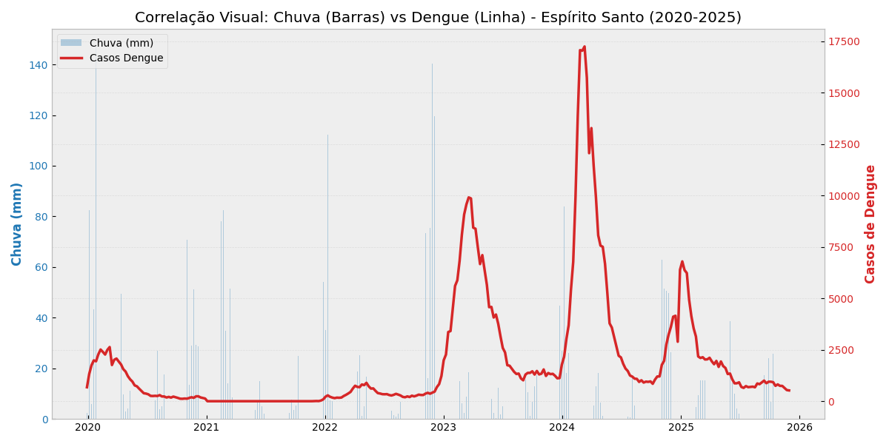

# Sentinela da Dengue

> [Read in English](README_en.md)

## Visão Geral do Projeto

Este projeto implementa um pipeline de Engenharia de Dados "End-to-End" para analisar a correlação entre condições climáticas (Temperatura/Precipitação) e casos de Dengue no estado do Espírito Santo, Brasil.

O objetivo principal é demonstrar um processo robusto de ETL utilizando a **Arquitetura Medalhão** (Bronze, Silver, Gold), garantindo integridade dos dados, preservação histórica e prontidão para análise. O pipeline processa dados de 78 municípios ao longo de um período de 6 anos (2020-2025).

## Arquitetura

O projeto está estruturado seguindo o padrão da Arquitetura Medalhão:

### 1. Camada Bronze (Dados Brutos)
*   **Origem:** Ingestão de APIs externas (**OpenMeteo** para Clima e **InfoDengue** para dados epidemiológicos).
*   **Armazenamento:** Dados armazenados em formato Apache Parquet.
*   **Particionamento:** Dados climáticos particionados fisicamente por `municipio_id` (Hive Partitioning) para otimizar consultas localizadas.

### 2. Camada Silver (Limpeza e Padronização)
*   **Transformação:** 
    *   Padronização de tipos de dados (Float/Int).
    *   **Normalização de Timezone:** Remoção de offsets UTC para garantir compatibilidade entre fontes distintas.
    *   **Agregação:** Conversão de registros climáticos diários em Resumos Epidemiológicos Semanais (Média de Temperatura, Soma de Precipitação).
*   **Saída:** `clima_municipios.parquet`, `clima_estado.parquet`, `dengue_municipios.parquet`.

### 3. Camada Gold (Analítica)
*   **Integração:** Joins realizados entre os datasets de Clima e Epidemiologia.
*   **Visões:**
    *   **Visão Macro:** Tendências agregadas a nível estadual.
    *   **Visão Micro:** Tabelas analíticas a nível municipal.
*   **Schema:** Colunas renomeadas para clareza de negócio (ex: `temp_media_semana`, `casos_confirmados`).

## Tecnologias Utilizadas

*   **Linguagem:** Python 3.10+
*   **Processamento de Dados:** Pandas, NumPy
*   **Formato de Armazenamento:** Apache Parquet
*   **APIs:** Open-Meteo, InfoDengue
*   **Visualização:** Matplotlib, Seaborn

## Estrutura do Repositório

```text
├── data/                   # Data Lake Storage (Ignorado pelo Git)
│   ├── bronze/             # Dados brutos de ingestão
│   ├── silver/             # Dados processados e limpos
│   └── gold/               # Tabelas analíticas finais
├── results/
│   └── graficos/           # Visualizações/Gráficos gerados
├── src/                    # Código Fonte
│   ├── ingestao_*.py       # Scripts de extração
│   ├── processamento_*.py  # Scripts de transformação (Bronze -> Silver)
│   ├── etl_gold.py         # Scripts de integração (Silver -> Gold)
│   └── visualizacao_*.py   # Scripts de Data Viz
└── requirements.txt        # Dependências do projeto
```

## Como Executar

Siga estes passos para reproduzir o ambiente e a execução do pipeline:

### 1. Configuração do Ambiente
```bash
# Criar ambiente virtual
python -m venv .venv

# Ativar ambiente (Linux/Mac)
source .venv/bin/activate

# Instalar dependências
pip install pandas pyarrow requests matplotlib seaborn openmeteo-requests requests-cache retry_requests
```

### 2. Pipeline de Execução
Execute os scripts na ordem lógica do fluxo de dados.

**Passo 1: Camada Bronze (Ingestão)**
```bash
python src/ingestao_clima_ES.py
python src/ingestao_dengue_ES.py
```

**Passo 2: Camada Silver (Processamento)**
```bash
python src/processamento_clima.py
python src/processamento_dengue.py
```

**Passo 3: Camada Gold (ETL)**
```bash
python src/etl_gold.py
```

**Passo 4: Análise e Visualização**
```bash
python src/visualizacao_analitica.py
```

## Resultados

O pipeline processa os dados brutos e gera visualizações analíticas que comprovam a correlação entre as variáveis climáticas e epidemiológicas.

Abaixo, o gráfico final gerado pelo projeto demonstra visualmente o "lag" (atraso) entre os picos de precipitação e a explosão de casos de dengue:


*(Figura 1: Barras azuis representam o volume de chuva (mm) e a linha vermelha indica os casos de dengue. Nota-se claramente o padrão sazonal após períodos chuvosos.)*

Os gráficos em alta resolução são salvos automaticamente no diretório `results/graficos` após a execução do script de visualização.

## Autor

Desenvolvido por **Felipe Zerbini**  | [LinkedIn](https://www.linkedin.com/in/felipe-zerbini/)
